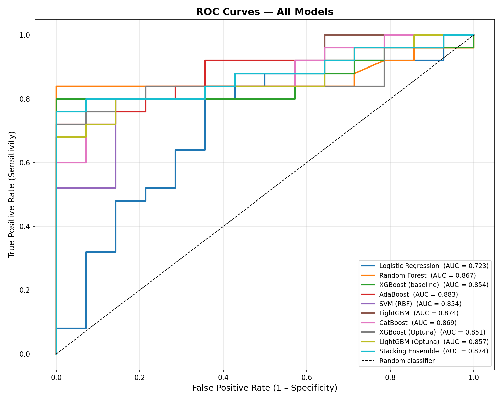
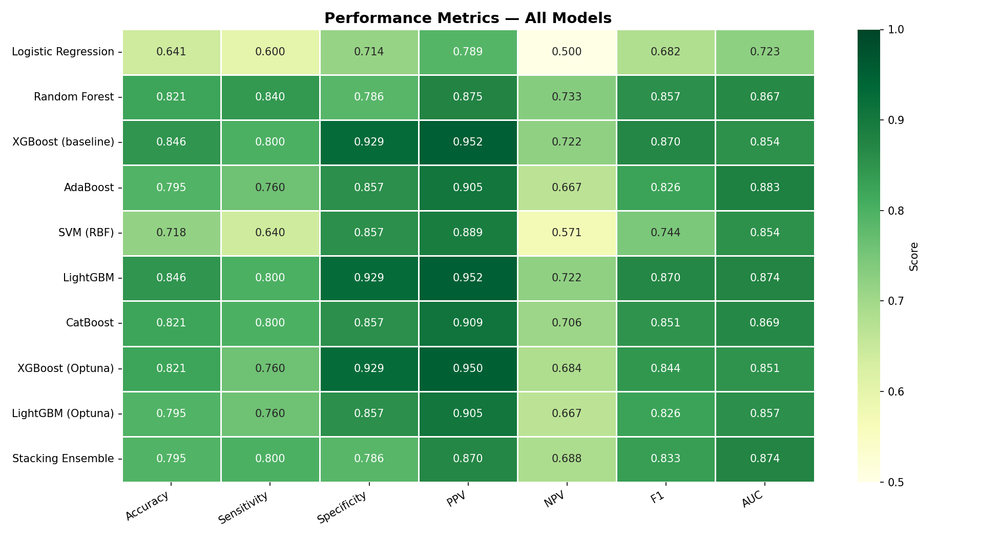
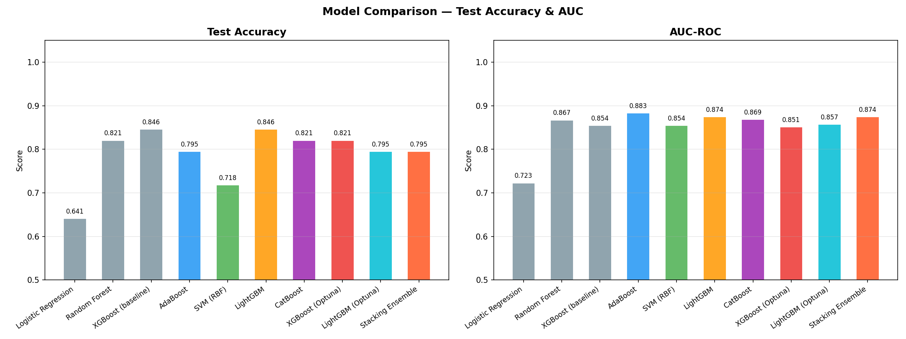
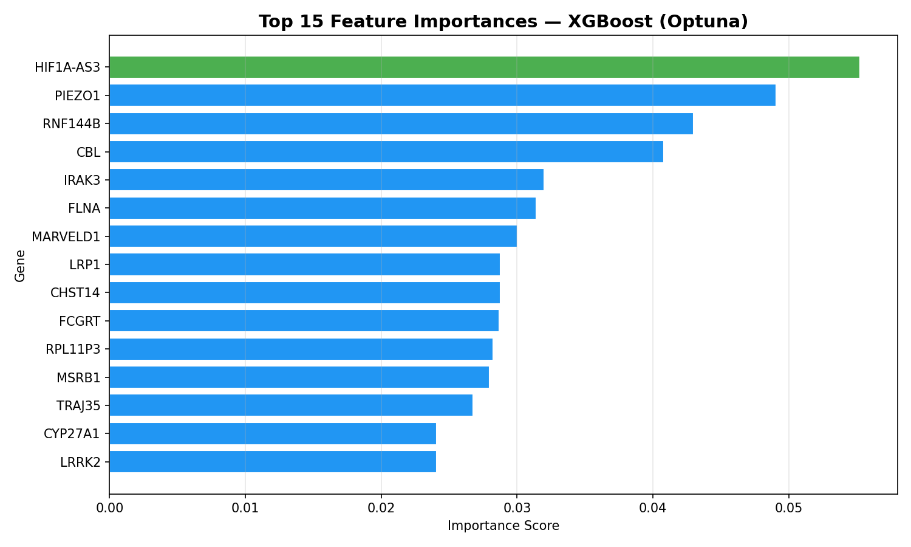
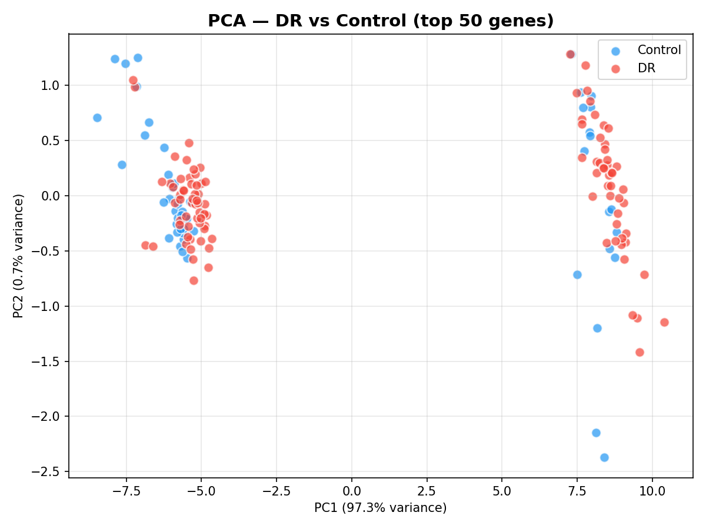
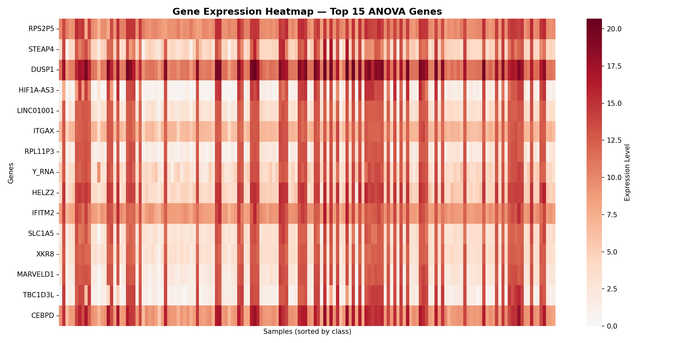

# Biomarker Discovery for Diabetic Retinopathy Using Machine Learning on Gene Expression Data

[](https://colab.research.google.com/github/SumitKatuwal3382/Biomarkers_Diabetes/blob/main/Biomarkers_test_2.ipynb)

---

## Abstract

Diabetic Retinopathy (DR) is a microvascular complication of diabetes mellitus and a leading cause of preventable blindness worldwide. Early molecular detection remains a critical unmet clinical need. This study presents a machine learning pipeline applied to high-dimensional gene expression data to: (1) identify statistically discriminative gene biomarkers distinguishing DR patients from healthy controls, and (2) evaluate ten supervised learning classifiers using a comprehensive set of clinical metrics. Using 195 patient samples across 9,432 gene features, we applied ANOVA-based feature selection, SMOTE oversampling for class imbalance, and compared models including Logistic Regression, Random Forest, AdaBoost, SVM, LightGBM, CatBoost, Bayesian-optimized XGBoost and LightGBM, and a Stacking Ensemble. XGBoost (baseline) and LightGBM achieved the highest test accuracy of **84.62%**, while AdaBoost achieved the highest AUC of **0.883**. Optuna-tuned XGBoost reached the best cross-validation accuracy of **86.50%**. Key candidate biomarkers identified include `HIF1A-AS3`, `PIEZO1`, `RNF144B`, `CBL`, and `IRAK3`.

---

## Table of Contents

1. [Background](#background)
2. [Dataset](#dataset)
3. [Methodology](#methodology)
4. [Results](#results)
   - [Full Metrics Table](#full-metrics-table-all-10-models)
   - [ROC Curves](#roc-curves)
   - [Metrics Heatmap](#metrics-heatmap)
5. [Candidate Biomarker Genes](#candidate-biomarker-genes)
6. [Visualizations](#visualizations)
7. [Discussion](#discussion)
8. [Reproducibility](#reproducibility)
9. [Repository Structure](#repository-structure)

---

## Background

Diabetic Retinopathy affects approximately one-third of all people with diabetes and is caused by progressive damage to the blood vessels of the retina. Clinical diagnosis relies on ophthalmoscopic imaging, which is expensive and requires specialist interpretation. Molecular biomarkers derived from gene expression profiling offer a complementary diagnostic route — one that could enable earlier, cheaper, and more scalable screening. Gene expression data is inherently high-dimensional and biologically noisy, making it a challenging target for machine learning.

---

## Dataset

| Property | Value |
|---|---|
| File | `FINAL_COMBINED_DATASET.csv` |
| Total samples | 195 patients |
| Gene expression features | 9,432 genes |
| Class — DR (Diabetic Retinopathy) | 125 samples (64.1%) |
| Class — Control (Healthy) | 70 samples (35.9%) |
| Class imbalance ratio | ~1.79 : 1 (DR : Control) |

---

## Methodology

### 1. Preprocessing
- Label encoding: `DR → 1`, `Control → 0`
- Stratified 80/20 train-test split: **156 train / 39 test** samples
- `random_state = 42` throughout for full reproducibility

### 2. Feature Selection — ANOVA F-Test
- One-way ANOVA applied to all 9,432 genes, selecting **top 50** most statistically discriminative between DR and Control
- Selector fitted on training data only — applied to test data to prevent data leakage
- **99.5% dimensionality reduction** (9,432 → 50 genes)

**Top 10 ANOVA-selected genes:**

| Rank | Gene | Biological Role |
|---|---|---|
| 1 | NEK6 | Serine/threonine kinase; mitotic regulation |
| 2 | KCNE3 | Potassium channel subunit; ion transport |
| 3 | RNPEPL1 | Aminopeptidase; protein processing |
| 4 | PLXNB2 | Plexin receptor; vascular development & angiogenesis |
| 5 | MSRB1 | Methionine sulfoxide reductase; oxidative stress |
| 6 | Y_RNA | Non-coding RNA; DNA replication & stress response |
| 7 | DUSP1 | Dual specificity phosphatase; MAPK pathway regulator |
| 8 | PRAM1 | PML-RARA regulated adaptor molecule |
| 9 | STEAP4 | Metalloreductase; inflammation & insulin signaling |
| 10 | EGR1 | Transcription factor; angiogenesis & hypoxia response |

### 3. Class Imbalance — SMOTE
SMOTE (Synthetic Minority Oversampling Technique) was applied to the training set to correct the 1.79:1 class imbalance, producing **200 balanced samples** (100 DR, 100 Control). Applied strictly to training data; the test set remains untouched real patient data.

### 4. Models Evaluated

| # | Model | Type | Train Set | Key Configuration |
|---|---|---|---|---|
| 1 | Logistic Regression | Linear | Original | `class_weight='balanced'` |
| 2 | Random Forest | Ensemble (Bagging) | Original | `n_estimators=300` |
| 3 | XGBoost (baseline) | Gradient Boosting | Original | `n_estimators=300, lr=0.05` |
| 4 | AdaBoost | Ensemble (Boosting) | SMOTE | `n_estimators=200, lr=0.5` |
| 5 | SVM (RBF kernel) | Kernel method | SMOTE | `C=10, gamma='scale'` |
| 6 | LightGBM | Gradient Boosting | SMOTE | `n_estimators=500, lr=0.05` |
| 7 | CatBoost | Gradient Boosting | SMOTE | `iterations=500, depth=6` |
| 8 | XGBoost (Optuna) | Gradient Boosting | SMOTE | 50-trial Bayesian search |
| 9 | LightGBM (Optuna) | Gradient Boosting | SMOTE | 50-trial Bayesian search |
| 10 | Stacking Ensemble | Meta-learner | SMOTE | SVM + LightGBM(O) + XGB(O) → LR |

All models evaluated with **5-fold stratified cross-validation** on training data and final metrics on the **held-out 20% test set**.

### 5. Metrics Definition

| Metric | Formula | Clinical Meaning |
|---|---|---|
| **Accuracy** | (TP + TN) / Total | Overall correct predictions |
| **Sensitivity** | TP / (TP + FN) | % of true DR cases correctly detected |
| **Specificity** | TN / (TN + FP) | % of true Controls correctly identified |
| **PPV** | TP / (TP + FP) | When model predicts DR, how often it's correct |
| **NPV** | TN / (TN + FN) | When model predicts Control, how often it's correct |
| **FPR** | FP / (FP + TN) | Rate of healthy patients wrongly flagged as DR |
| **F1 Score** | 2 × (PPV × Sens) / (PPV + Sens) | Harmonic mean of PPV and Sensitivity |
| **AUC** | Area under ROC curve | Overall discrimination ability (1.0 = perfect) |

*(DR = positive class, Control = negative class)*

---

## Results

### Full Metrics Table — All 10 Models

| Model | CV Acc | Acc | Sens | Spec | PPV | NPV | FPR | F1 | AUC |
|---|---|---|---|---|---|---|---|---|---|
| Logistic Regression | 0.519 | 0.641 | 0.600 | 0.714 | 0.789 | 0.500 | 0.286 | 0.682 | 0.723 |
| Random Forest | 0.762 | 0.821 | **0.840** | 0.786 | 0.875 | 0.733 | 0.214 | 0.857 | 0.867 |
| XGBoost (baseline) | 0.724 | **0.846** | 0.800 | **0.929** | **0.952** | 0.722 | **0.071** | **0.870** | 0.854 |
| AdaBoost | 0.825 | 0.795 | 0.760 | 0.857 | 0.905 | 0.667 | 0.143 | 0.826 | **0.883** |
| SVM (RBF) | 0.770 | 0.718 | 0.640 | 0.857 | 0.889 | 0.571 | 0.143 | 0.744 | 0.854 |
| LightGBM | 0.810 | **0.846** | 0.800 | **0.929** | **0.952** | 0.722 | **0.071** | **0.870** | 0.874 |
| CatBoost | 0.830 | 0.821 | 0.800 | 0.857 | 0.909 | 0.706 | 0.143 | 0.851 | 0.869 |
| XGBoost (Optuna) | **0.865** | 0.821 | 0.760 | **0.929** | 0.950 | 0.684 | **0.071** | 0.844 | 0.851 |
| LightGBM (Optuna) | 0.835 | 0.795 | 0.760 | 0.857 | 0.905 | 0.667 | 0.143 | 0.826 | 0.857 |
| Stacking Ensemble | 0.815 | 0.795 | 0.800 | 0.786 | 0.870 | 0.688 | 0.214 | 0.833 | 0.874 |

**Bold** = best value in that column.

#### Key highlights
- **Best Test Accuracy (84.62%):** XGBoost (baseline) and LightGBM — tied
- **Best AUC (0.883):** AdaBoost — strongest overall discrimination
- **Best Sensitivity (0.840):** Random Forest — detects the most true DR cases
- **Best Specificity (0.929):** XGBoost (baseline), LightGBM, XGBoost (Optuna) — fewest false alarms
- **Best PPV (0.952):** XGBoost (baseline) and LightGBM — most reliable positive predictions
- **Best CV Accuracy (86.50%):** XGBoost (Optuna) — strongest generalization across folds
- **Lowest FPR (0.071):** XGBoost (baseline), LightGBM, XGBoost (Optuna) — fewest healthy patients wrongly flagged

### ROC Curves


ROC curves plot Sensitivity (True Positive Rate) against FPR (False Positive Rate) at all classification thresholds. A curve closer to the top-left corner indicates better performance. All models significantly outperform the random classifier diagonal. **AdaBoost** achieves the highest AUC (0.883), meaning it has the best overall discrimination ability regardless of threshold choice — an important property for a clinical screening tool where the threshold can be adjusted based on desired sensitivity/specificity trade-off.

### Metrics Heatmap


Color-coded performance across all metrics and models. Darker green = higher score. This allows rapid visual comparison of where each model excels and where it falls short. Note that no single model dominates all metrics simultaneously — the optimal choice depends on clinical priorities (e.g., maximizing sensitivity vs. minimizing FPR).

### Model Comparison — Accuracy & AUC


---

## Candidate Biomarker Genes

### Top 5 — XGBoost (Optuna) Feature Importance

These genes contributed most to XGBoost classification decisions. Feature importance measures the average gain a gene provides across all decision trees — capturing predictive contribution within a non-linear model, beyond simple statistical difference.

| Rank | Gene | Importance | Biological Relevance |
|---|---|---|---|
| 1 | **HIF1A-AS3** | 0.0552 | Antisense RNA for HIF-1α; master regulator of hypoxia response and retinal neovascularization — a core mechanism of advanced DR |
| 2 | **PIEZO1** | 0.0491 | Mechanosensitive ion channel; linked to red blood cell dehydration, vascular integrity, and diabetic vascular complications |
| 3 | **RNF144B** | 0.0430 | E3 ubiquitin ligase; involved in DNA damage response and apoptosis — relevant to retinal cell death in DR |
| 4 | **CBL** | 0.0408 | E3 ubiquitin ligase; negative regulator of receptor tyrosine kinase signaling, including VEGF pathway central to retinal angiogenesis |
| 5 | **IRAK3** | 0.0320 | IL-1 receptor-associated kinase 3; modulates inflammatory signaling — chronic inflammation is a hallmark of DR progression |

### ANOVA Top Genes (also present in XGBoost importance)
- **PLXNB2** — appeared in both ANOVA top-10 and XGBoost importance rankings, making it a strong converging candidate for further validation



**Biological interpretation:**
- `HIF1A-AS3` regulates the hypoxia-inducible factor (HIF-1α) pathway, which directly drives the retinal neovascularization seen in proliferative DR. Its top ranking is biologically coherent.
- `CBL`-mediated suppression of VEGF signaling is directly relevant — VEGF (vascular endothelial growth factor) is the primary therapeutic target in current anti-DR treatments (anti-VEGF injections).
- `IRAK3` links to the NF-κB inflammatory cascade, which is increasingly recognized as central to early DR pathogenesis.
- These genes warrant validation via qPCR, Western blotting, and pathway enrichment analysis (GSEA/KEGG).

---

## Visualizations

### PCA Plot


Dimensionality reduction of the 50 ANOVA-selected genes to 2 principal components. Partial but visible cluster separation between DR (red) and Control (blue) confirms that the selected gene features carry meaningful biological signal separating the two classes.

### Gene Expression Heatmap — Top 15 Genes


Expression levels of the top 15 ANOVA-ranked genes across 156 training samples (sorted by class). **Red = high expression, Blue = low expression.** Visible horizontal banding across patient groups indicates consistent differential expression — the hallmark signature of a diagnostic biomarker.

---

## Discussion

### Model selection for clinical use
In a DR screening context, **sensitivity (recall for DR)** is the most critical metric — a missed DR case (false negative) can lead to untreated disease progression and vision loss. Against this priority:
- **Random Forest** achieves the best sensitivity (0.840)
- **AdaBoost** achieves the best AUC (0.883), meaning it offers the most flexibility to trade off sensitivity vs. specificity by adjusting the decision threshold
- **XGBoost (baseline) and LightGBM** offer the best balance: highest accuracy (84.62%), best specificity (0.929), and lowest FPR (0.071) — minimizing unnecessary referrals in a screening setting

### Why Optuna-tuned models didn't dominate the test set
With only 39 test samples, a single misclassification changes accuracy by 2.56 percentage points. Extensive hyperparameter tuning on the training distribution can overfit to it, causing slightly lower test performance than CV suggests. **Optuna XGBoost achieved the best CV accuracy (86.50%)** — a more robust estimate of generalization. Nested cross-validation would give an even more unbiased evaluation.

### LightGBM as a strong baseline-level model
LightGBM (with default tuning) matched XGBoost baseline exactly (84.62% accuracy, identical Specificity/PPV/FPR). Given its faster training speed and strong performance, it is a compelling alternative for larger datasets.

### Limitations
1. **Small sample size (n=195):** Limits statistical power. External validation on an independent cohort is needed.
2. **Single train-test split:** A single 80/20 split introduces variance. Results should be confirmed with repeated stratified k-fold CV.
3. **SMOTE artifacts:** Synthetic oversampling may not fully preserve real gene co-expression relationships.
4. **ANOVA limitation:** Tests each gene independently — does not capture gene-gene interaction effects.
5. **No pathway-level analysis:** Gene importance scores should be followed up with GSEA or KEGG pathway enrichment to confirm biological plausibility.

---

## Reproducibility

```bash
pip install pandas numpy scikit-learn xgboost catboost lightgbm imbalanced-learn optuna matplotlib seaborn

python3 run_analysis.py
```

| Setting | Value |
|---|---|
| `random_state` | 42 (all models) |
| CV strategy | 5-fold StratifiedKFold |
| Train/test split | 80% / 20% stratified |
| Optuna trials | 50 per model |
| Feature selection | ANOVA F-test, k=50 |
| Imbalance correction | SMOTE (training only) |

**Output files:** `roc_curves.png`, `metrics_heatmap.png`, `model_comparison.png`, `pca_plot.png`, `heatmap.png`, `feature_importance.png`

---

## Repository Structure

```
Biomarkers_Diabetes/
├── run_analysis.py              # Full pipeline — all 10 models, all metrics
├── Biomarkers_test_2.ipynb      # Original Colab notebook (exploratory)
├── FINAL_COMBINED_DATASET.csv   # Dataset (gitignored — not on GitHub)
├── roc_curves.png               # ROC curves for all 10 models
├── metrics_heatmap.png          # Heatmap of all metrics across all models
├── model_comparison.png         # Accuracy & AUC bar charts
├── pca_plot.png                 # PCA — DR vs Control
├── heatmap.png                  # Gene expression heatmap (top 15 genes)
├── feature_importance.png       # XGBoost feature importances (top 15 genes)
├── .gitignore
└── README.md
```

---

## Requirements

```
pandas >= 1.3        numpy >= 1.21
scikit-learn >= 1.0  xgboost >= 1.6
catboost >= 1.0      lightgbm >= 3.3
imbalanced-learn >= 0.9  optuna >= 3.0
matplotlib >= 3.4    seaborn >= 0.11
```
