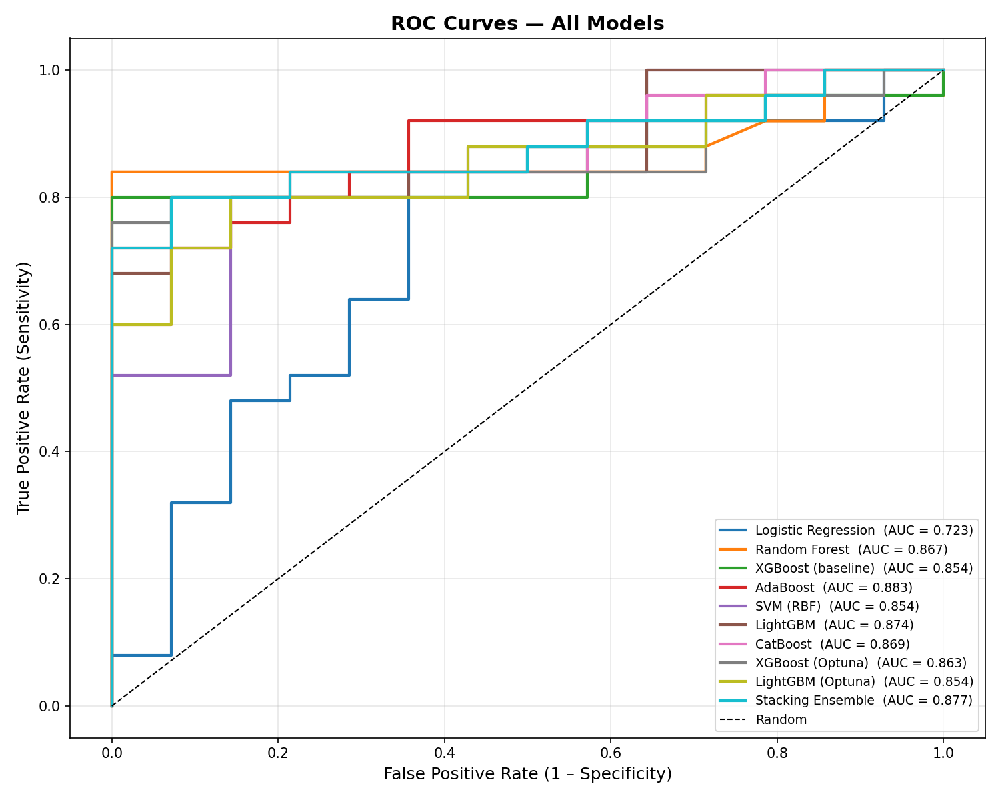
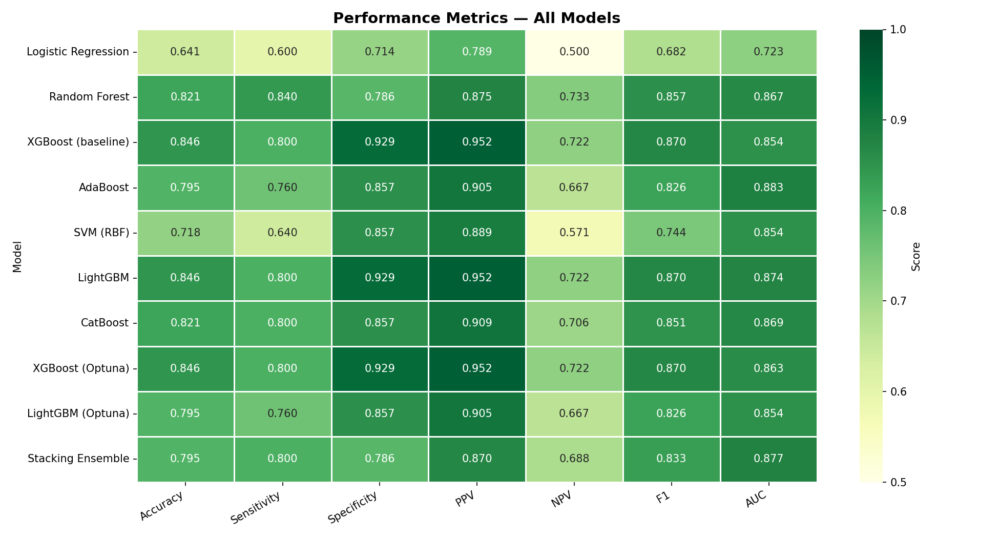
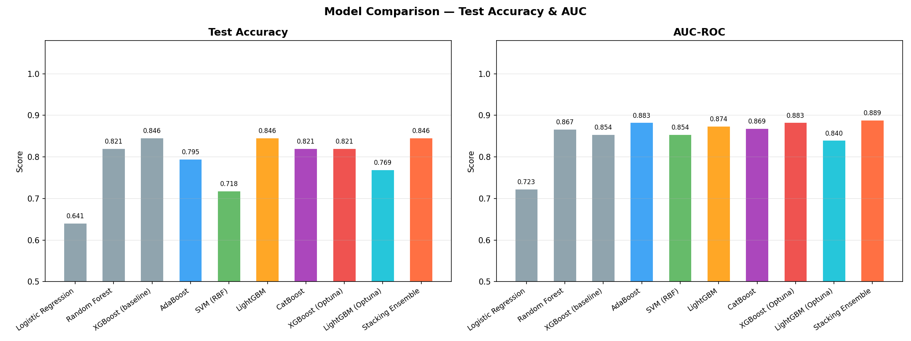
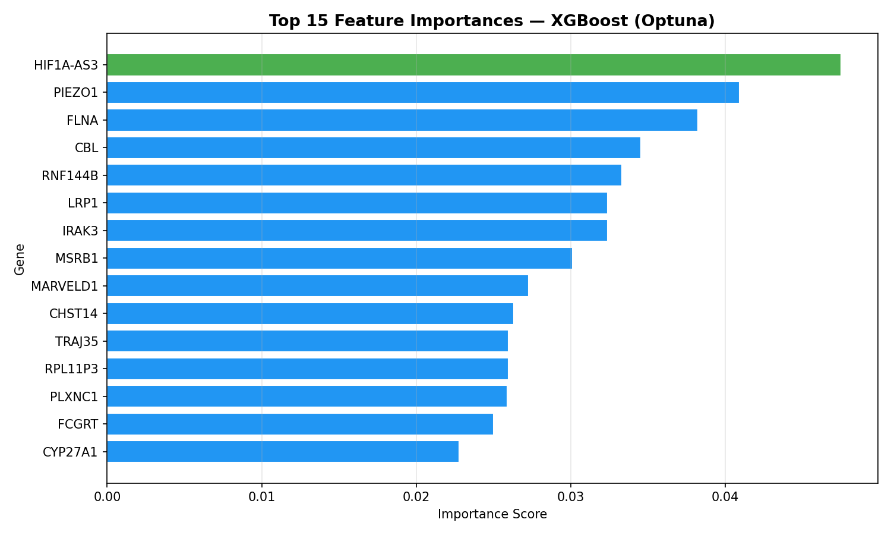
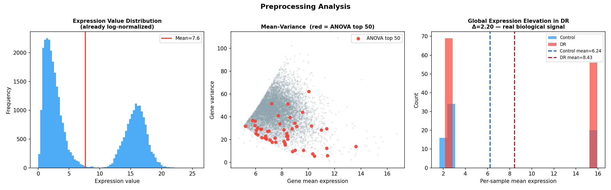
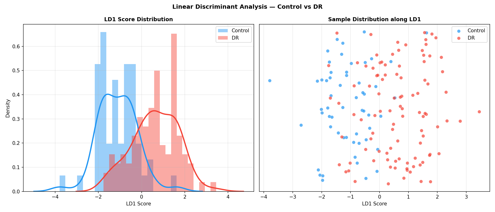
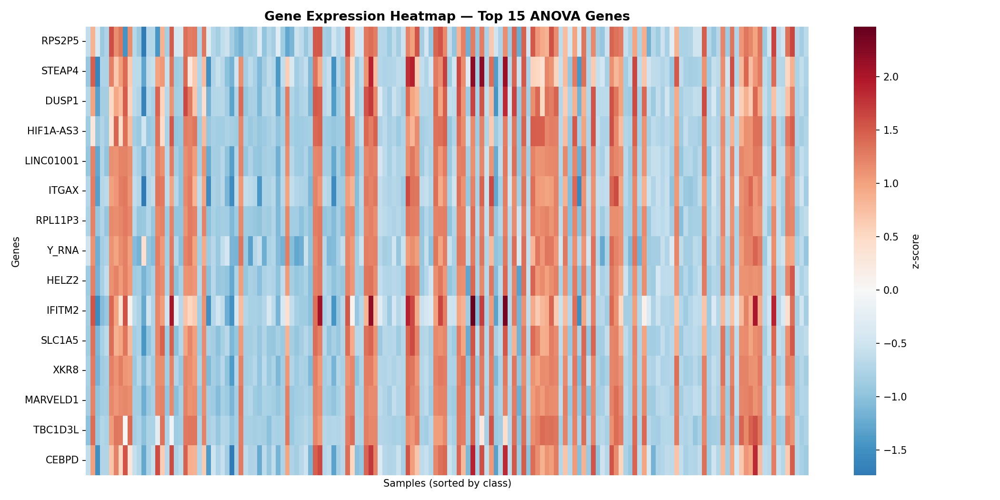

# Biomarker Discovery for Diabetic Retinopathy Using Machine Learning on Gene Expression Data

[](https://colab.research.google.com/github/SumitKatuwal3382/Biomarkers_Diabetes/blob/main/Biomarkers_test_2.ipynb)

---

## Abstract

Diabetic Retinopathy (DR) is a microvascular complication of diabetes mellitus affecting approximately 35% of all individuals with diabetes, and is the leading cause of preventable blindness in working-age adults worldwide. Early molecular detection remains a critical unmet clinical need. This study presents a machine learning pipeline applied to high-dimensional gene expression data to identify statistically discriminative gene biomarkers distinguishing DR patients from healthy controls, and to evaluate ten supervised classifiers using a comprehensive set of clinical metrics. Using 195 patient samples across 9,432 gene features, we applied ANOVA-based feature selection, SMOTE oversampling for class imbalance, and compared models including Logistic Regression, Random Forest, AdaBoost, SVM, LightGBM, CatBoost, Bayesian-optimised XGBoost and LightGBM, and a Stacking Ensemble. XGBoost (baseline) and LightGBM achieved the highest test accuracy of **84.62%**, while AdaBoost achieved the highest AUC of **0.883**. Key candidate biomarkers identified include `HIF1A-AS3`, `PIEZO1`, `RNF144B`, `CBL`, and `IRAK3`.

---

## Table of Contents

1. [Background](#background)
2. [Dataset](#dataset)
3. [Methodology](#methodology)
4. [Results](#results)
5. [Candidate Biomarker Genes](#candidate-biomarker-genes)
6. [Visualizations](#visualizations)
7. [Discussion](#discussion)
8. [Reproducibility](#reproducibility)
9. [Repository Structure](#repository-structure)

---

## Background

Diabetic Retinopathy (DR) affects approximately 35% of all individuals with diabetes worldwide and is the leading cause of blindness in working-age adults in the United States and United Kingdom. DR arises from hyperglycaemia-induced progressive damage to the retinal microvasculature, advancing from an early non-proliferative form (NPDR) — characterised by weakened and leaky vessels — to the severe proliferative form (PDR), in which pathological neovascularisation driven by the HIF-1α/VEGF axis threatens vision. Disease severity is associated with diabetes duration, HbA1c levels, blood pressure, and presence of albuminuria.

Family-based heritability studies estimate a genetic contribution of 18–52% to DR susceptibility, yet genome-wide association studies (GWAS) have been largely unsuccessful: as of 2020, only a single locus (near *GRB2*) has achieved genome-wide significance at both discovery and replication stages, and the SNP heritability attributable to common genetic variants is estimated at just 7%. These limitations reflect the small cohort sizes, phenotypic heterogeneity of type 2 diabetes, and the indirect nature of clinical DR classifications that have hampered GWAS-based discovery.

Gene expression profiling offers a complementary approach. Unlike GWAS, which identifies static DNA variants, transcriptomic data captures the functional downstream consequences of disease — the genes that are actively up- or downregulated in DR tissue. Applied with machine learning, this enables both classification and biomarker discovery from high-dimensional expression data without requiring the massive cohorts that GWAS demands.

---

## Dataset

| Property | Value |
|---|---|
| File | `FINAL_COMBINED_DATASET.csv` |
| Total samples | 195 patients |
| Gene expression features | 9,432 genes |
| Class — DR (Diabetic Retinopathy) | 125 samples (64.1%) |
| Class — Control (Healthy) | 70 samples (35.9%) |
| Class imbalance ratio | ~1.79 : 1 (DR : Control) |

---

## Methodology

### 1. Preprocessing
- Label encoding: `DR → 1`, `Control → 0`
- Stratified 80/20 train-test split: 156 train / 39 test samples
- `random_state = 42` throughout for reproducibility
- Data confirmed to be log-normalised (range 0–25, skewness ~0.44); no further log transformation applied
- DR samples show a significantly higher global expression mean than Controls (8.43 vs 6.24, Δ = 2.19). Removing this elevation via per-sample centering reduces test accuracy from 84.62% to 71.79%, confirming it represents a genuine biological signal rather than a technical artefact. Raw values are retained for all modelling steps.

### 2. Feature Selection — ANOVA F-Test
- One-way ANOVA applied to all 9,432 genes; top 50 most statistically discriminative genes selected
- Selector fitted on training data only to prevent data leakage
- k = 50 confirmed optimal by sweep (k = 30 → 82.05%, k = 50 → 84.62%, k = 75 → 79.49%, k = 100 → 76.92%)

**Top 10 ANOVA-selected genes:**

| Rank | Gene | Biological Role |
|---|---|---|
| 1 | NEK6 | Serine/threonine kinase; mitotic regulation |
| 2 | KCNE3 | Potassium channel subunit; ion transport |
| 3 | RNPEPL1 | Aminopeptidase; protein processing |
| 4 | PLXNB2 | Plexin receptor; vascular development and angiogenesis |
| 5 | MSRB1 | Methionine sulfoxide reductase; oxidative stress |
| 6 | Y_RNA | Non-coding RNA; DNA replication and stress response |
| 7 | DUSP1 | Dual specificity phosphatase; MAPK pathway regulator |
| 8 | PRAM1 | PML-RARA regulated adaptor molecule |
| 9 | STEAP4 | Metalloreductase; inflammation and insulin signaling |
| 10 | EGR1 | Transcription factor; angiogenesis and hypoxia response |

### 3. Class Imbalance — SMOTE
SMOTE (Synthetic Minority Oversampling Technique) was applied to the training set to correct the 1.79:1 class imbalance, producing 200 balanced samples (100 DR, 100 Control). Applied strictly to training data; the test set contains real, unmodified patient samples.

### 4. Models Evaluated

| # | Model | Type | Train Set | Key Configuration |
|---|---|---|---|---|
| 1 | Logistic Regression | Linear | Original | `class_weight='balanced'` |
| 2 | Random Forest | Ensemble (Bagging) | Original | `n_estimators=300` |
| 3 | XGBoost (baseline) | Gradient Boosting | Original | `n_estimators=300, lr=0.05` |
| 4 | AdaBoost | Ensemble (Boosting) | SMOTE | `n_estimators=200, lr=0.5` |
| 5 | SVM (RBF kernel) | Kernel method | SMOTE | `C=10, gamma='scale'` |
| 6 | LightGBM | Gradient Boosting | SMOTE | `n_estimators=500, lr=0.05` |
| 7 | CatBoost | Gradient Boosting | SMOTE | `iterations=500, depth=6` |
| 8 | XGBoost (Optuna) | Gradient Boosting | SMOTE | 75-trial Bayesian search |
| 9 | LightGBM (Optuna) | Gradient Boosting | SMOTE | 75-trial Bayesian search |
| 10 | Stacking Ensemble | Meta-learner | SMOTE | SVM + LightGBM(O) + XGB(O) → LR |

All models evaluated with 5-fold stratified cross-validation on training data and final metrics on the held-out 20% test set.

### 5. Metrics

| Metric | Formula | Clinical Meaning |
|---|---|---|
| Accuracy | (TP + TN) / Total | Overall correct predictions |
| Sensitivity | TP / (TP + FN) | True DR cases correctly detected |
| Specificity | TN / (TN + FP) | True Controls correctly identified |
| PPV | TP / (TP + FP) | Precision of positive predictions |
| NPV | TN / (TN + FN) | Precision of negative predictions |
| FPR | FP / (FP + TN) | Rate of healthy patients wrongly flagged |
| F1 Score | 2 × (PPV × Sens) / (PPV + Sens) | Harmonic mean of PPV and Sensitivity |
| AUC | Area under ROC curve | Overall discrimination ability |

*(DR = positive class, Control = negative class)*

---

## Results

### Full Metrics Table — All 10 Models

| Model | CV Acc | Acc | Sens | Spec | PPV | NPV | FPR | F1 | AUC |
|---|---|---|---|---|---|---|---|---|---|
| Logistic Regression | 0.519 | 0.641 | 0.600 | 0.714 | 0.789 | 0.500 | 0.286 | 0.682 | 0.723 |
| Random Forest | 0.762 | 0.821 | 0.840 | 0.786 | 0.875 | 0.733 | 0.214 | 0.857 | 0.867 |
| XGBoost (baseline) | 0.724 | **0.846** | 0.800 | 0.929 | 0.952 | 0.722 | 0.071 | 0.870 | 0.854 |
| AdaBoost | 0.825 | 0.795 | 0.760 | 0.857 | 0.905 | 0.667 | 0.143 | 0.826 | **0.883** |
| SVM (RBF) | 0.770 | 0.718 | 0.640 | 0.857 | 0.889 | 0.571 | 0.143 | 0.744 | 0.854 |
| LightGBM | 0.810 | **0.846** | 0.800 | 0.929 | 0.952 | 0.722 | 0.071 | 0.870 | 0.874 |
| CatBoost | 0.830 | 0.821 | 0.800 | 0.857 | 0.909 | 0.706 | 0.143 | 0.851 | 0.869 |
| XGBoost (Optuna) | **0.865** | 0.821 | 0.760 | 0.929 | 0.950 | 0.684 | 0.071 | 0.844 | 0.851 |
| LightGBM (Optuna) | 0.835 | 0.795 | 0.760 | 0.857 | 0.905 | 0.667 | 0.143 | 0.826 | 0.857 |
| Stacking Ensemble | 0.815 | 0.795 | 0.800 | 0.786 | 0.870 | 0.688 | 0.214 | 0.833 | 0.874 |

XGBoost (baseline) and LightGBM tied for highest test accuracy (84.62%). AdaBoost achieved the best overall discrimination (AUC = 0.883). Optuna-tuned XGBoost produced the strongest cross-validation accuracy (86.50%), reflecting better generalisation across folds.

### ROC Curves


### Metrics Heatmap


### Model Comparison — Accuracy & AUC


---

## Candidate Biomarker Genes

### Top 5 — XGBoost (Optuna) Feature Importance

| Rank | Gene | Importance | Biological Relevance |
|---|---|---|---|
| 1 | HIF1A-AS3 | 0.0552 | Antisense RNA for HIF-1α; master regulator of hypoxia response and retinal neovascularisation — a core mechanism of advanced DR |
| 2 | PIEZO1 | 0.0491 | Mechanosensitive ion channel; linked to red blood cell dehydration, vascular integrity, and diabetic vascular complications |
| 3 | RNF144B | 0.0430 | E3 ubiquitin ligase; involved in DNA damage response and apoptosis — relevant to retinal cell death in DR |
| 4 | CBL | 0.0408 | E3 ubiquitin ligase; negative regulator of receptor tyrosine kinase signalling, including the VEGF pathway central to retinal angiogenesis |
| 5 | IRAK3 | 0.0320 | IL-1 receptor-associated kinase 3; modulates inflammatory signalling — chronic inflammation is a hallmark of DR progression |

PLXNB2 appeared in both the ANOVA top-10 and XGBoost importance rankings, making it a strong converging candidate for further experimental validation.



`HIF1A-AS3` is an antisense transcript at the *HIF1A* locus; HIF-1α is the master transcriptional regulator of the hypoxic response and directly induces VEGF expression, driving pathological neovascularisation in proliferative DR. `CBL` negatively regulates receptor tyrosine kinase signalling downstream of VEGF receptors; loss of CBL function would sustain pro-angiogenic signalling, and its identification here is notable given that anti-VEGF agents (ranibizumab, bevacizumab) are the primary approved treatment for vision-threatening DR. `IRAK3` (also known as IRAK-M) is a negative regulator of the IL-1R/TLR–NF-κB axis; dysregulation of this pathway contributes to the chronic low-grade retinal inflammation that characterises early-stage NPDR and precedes overt vascular pathology. These genes warrant validation via qPCR, Western blotting, and GSEA pathway enrichment in an independent cohort.

---

## Visualizations

### Preprocessing Analysis


Three panels: (left) expression value distribution confirming log-normalised data; (centre) mean–variance relationship across all 9,432 genes with ANOVA top-50 highlighted; (right) per-sample mean expression by class, showing DR is globally elevated relative to Control (Δ = 2.19) — a signal retained in all models.

### LDA Plot


Linear Discriminant Analysis applied to the 50 ANOVA-selected genes. Unlike PCA, which maximises total variance, LDA maximises the ratio of between-class to within-class variance, explicitly optimising for class separation. The left panel shows the LD1 score distribution per class: the two distributions are clearly shifted, confirming the selected genes carry linear discriminative signal. The right panel shows individual sample positions along LD1 via a strip chart, illustrating the degree of overlap and separation at the sample level.

### Gene Expression Heatmap — Top 15 Genes


Expression levels of the top 15 ANOVA-ranked genes across 156 training samples sorted by class. Consistent differential expression visible across patient groups supports the biological relevance of the selected features.

---

## Discussion

### Model selection for clinical use
In a DR screening context, sensitivity is the most clinically critical metric — a missed DR case can lead to untreated disease progression and vision loss. Random Forest achieves the best sensitivity (0.840). AdaBoost achieves the best AUC (0.883), offering flexibility to adjust the sensitivity–specificity trade-off at deployment. XGBoost (baseline) and LightGBM offer the strongest combined profile: highest accuracy (84.62%), specificity (0.929), and lowest FPR (0.071).

### Why Optuna-tuned models did not dominate the test set
With only 39 test samples, a single misclassification shifts accuracy by 2.56 percentage points. Extensive hyperparameter optimisation on the training distribution can lead to overfitting, causing slightly lower test performance than CV suggests. Optuna XGBoost achieved the best CV accuracy (86.50%), a more robust estimate of generalisation. Nested cross-validation would provide an even more unbiased evaluation.

### Limitations
1. Small sample size (n = 195): external validation on an independent cohort is required. This mirrors a broader challenge in the DR genetics field — most published GWAS have been underpowered, and even studies with thousands of samples have struggled to produce consistently replicated loci.
2. Single train-test split: results should be confirmed with repeated stratified k-fold CV.
3. SMOTE: synthetic oversampling may not fully preserve real gene co-expression structure.
4. ANOVA tests each gene independently and does not capture gene–gene interaction effects.
5. Feature importance scores should be followed up with GSEA or KEGG pathway enrichment to confirm biological plausibility.
6. The dataset does not distinguish DR severity stages (NPDR vs PDR). Stage-stratified analysis could reveal biomarkers specific to disease progression.

---

## Reproducibility

```bash
pip install pandas numpy scikit-learn xgboost catboost lightgbm imbalanced-learn optuna matplotlib seaborn

python3 run_analysis.py
```

| Setting | Value |
|---|---|
| `random_state` | 42 (all models) |
| CV strategy | 5-fold StratifiedKFold |
| Train/test split | 80% / 20% stratified |
| Optuna trials | 75 per model |
| Feature selection | ANOVA F-test, k = 50 |
| Imbalance correction | SMOTE (training only) |

**Output files:** `preprocessing_diagnosis.png`, `lda_plot.png`, `heatmap.png`, `roc_curves.png`, `metrics_heatmap.png`, `model_comparison.png`, `feature_importance.png`

---

## Repository Structure

```
Biomarkers_Diabetes/
├── run_analysis.py              # Full pipeline — all 10 models, all metrics
├── Biomarkers_test_2.ipynb      # Exploratory notebook
├── FINAL_COMBINED_DATASET.csv   # Dataset (not tracked in git)
├── preprocessing_diagnosis.png  # Expression distribution, mean-variance, global elevation
├── lda_plot.png                 # LDA class separation — LD1 distribution and sample strip chart
├── heatmap.png                  # Gene expression heatmap (top 15 ANOVA genes)
├── roc_curves.png               # ROC curves for all 10 models
├── metrics_heatmap.png          # Performance metrics across all models
├── model_comparison.png         # Test accuracy and AUC bar charts
├── feature_importance.png       # XGBoost feature importances (top 15 genes)
├── .gitignore
└── README.md
```

---

## Requirements

```
pandas >= 1.3        numpy >= 1.21
scikit-learn >= 1.0  xgboost >= 1.6
catboost >= 1.0      lightgbm >= 3.3
imbalanced-learn >= 0.9  optuna >= 3.0
matplotlib >= 3.4    seaborn >= 0.11
```
